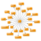

#  Word Associations **flow**ground Connector

## Description

A generated **flow**ground connector for the Word Associations API (version 1.0).

Generated from: https://api.apis.guru/v2/specs/wordassociations.net/1.0/swagger.json 
Generated at: 2019-05-07T17:45:00+03:00

## API Description

The Word Associations Network API allows developers to embed the ability to find associations for a word or phrase into their mobile apps or web services. Words are grouped by semantics, meaning, and psychological perception. The Word Associations Network API currently supports English, French, Spanish, German, Italian, Portuguese, and Russian vocabulary. Please [register and subscribe](https://api.wordassociations.net/subscriptions/) to one of available tariff plans to get a valid API key.

## Authorization

Supported authorization schemes:
- API Key
## Actions

### Gets associations with the given word or phrase.

#### Input Parameters
* `text` - _required_ - Word or phrase to find associations with.
Tip. You can use multiple parameters 'text' in a request (from 1 to 10 inclusive). This way you can get associations for several input words or phrases in one response.
Restriction: regardless of the size of the text association lookup is always performed by the first 10 words of the text.

* `lang` - _required_ - Query language. Use language code for the language of the text:
* de - German;
* en - English;
* es - Spanish;
* fr - French;
* it - Italian;
* pt - Portuguese;
* ru - Russian;

    Possible values: de, en, es, fr, it, pt, ru.
* `type` - _optional_ - Type of result.
Possible values: 
* stimulus - an input data (the text parameter) is considered as a response word. The service returns a list of stimuli words, which evoke a given response word;
* response - an input data (the text parameter) is considered as a stimulus word. The service returns a list of response words, which come to mind for a given stimulus word.

    Possible values: stimulus, response.
* `limit` - _optional_ - Maximum number of results to return.
Allows to limit the number of results (associations) in response.
The value of this parameter is an integer number from 1 to 300 inclusive.

* `pos` - _optional_ - Parts of speech to return.
Allows to limit results by specified parts of speech. The value of this parameter is a list of parts of speech separated by comma.
The following parts of speech codes are supported:
* noun
* adjective
* verb
* adverb

* `indent` - _optional_ - Indentation switch for pretty printing of JSON response.
Allows to either turn on or off space indentation for a response.
The following values are allowed:
* yes - turns indentation with spaces on;
* no - turn indentation with spaces off;

    Possible values: yes, no.

### Gets associations with the given word or phrase.

## License

**flow**ground :- Telekom iPaaS / wordassociations-net-connector 
Copyright © 2019, [Deutsche Telekom AG](https://www.telekom.de) 
contact: flowground@telekom.de

All files of this connector are licensed under the Apache 2.0 License. For details
see the file LICENSE on the toplevel directory.
